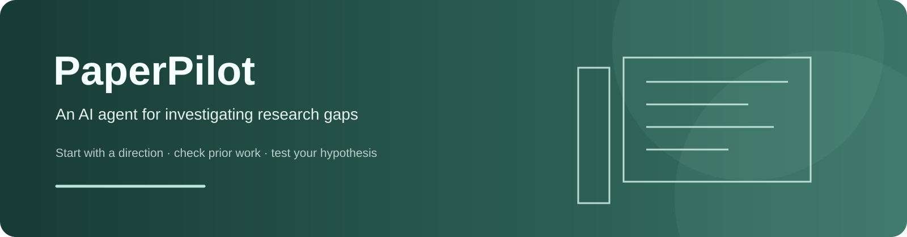
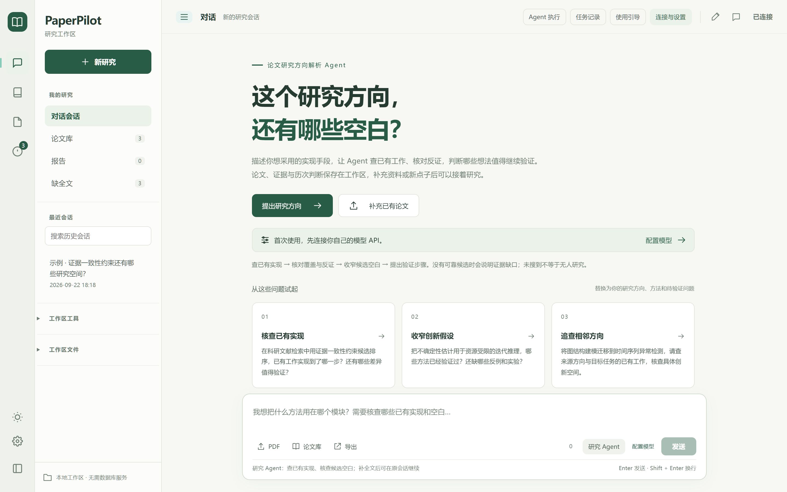
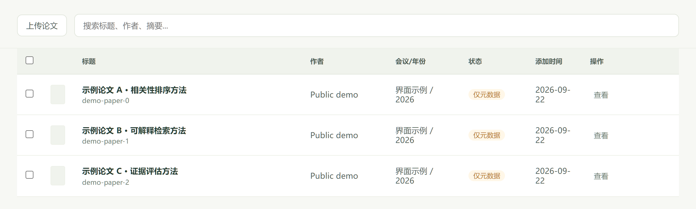
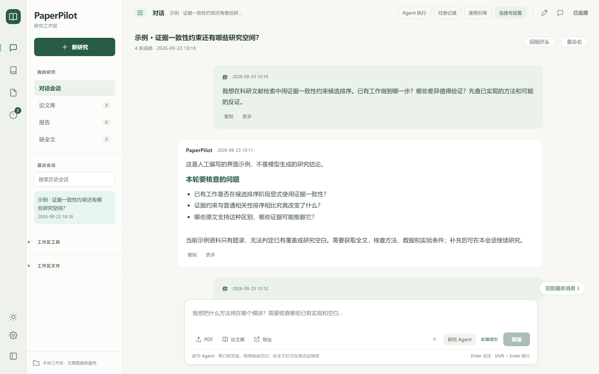
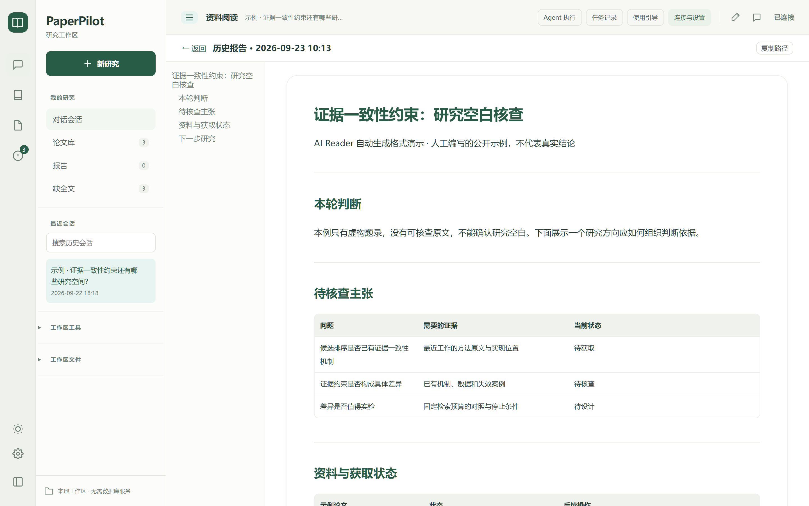
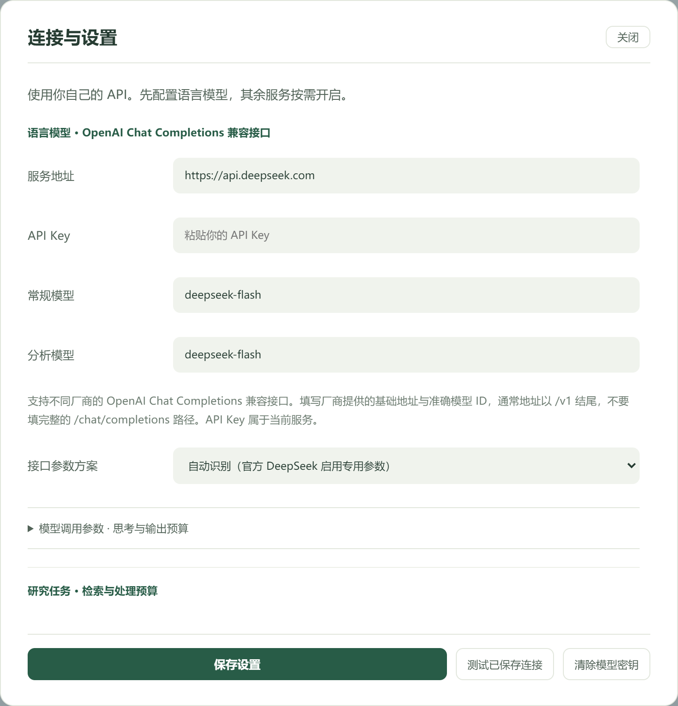
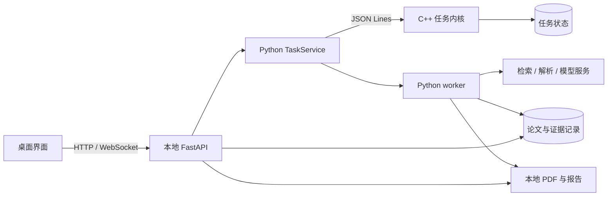

<p align="center">
  
</p>

<p align="center">
  <a href="#下载与开始使用">下载与开始使用</a> ·
  <a href="#围绕一个方向探索研究空白">使用方式</a> ·
  <a href="docs/WORKSPACE_GUIDE.md">工作区与备份</a> ·
  <a href="docs/ARCHITECTURE.md">后端设计</a> ·
  <a href="README.en.md">English</a>
</p>

<p align="center">
  
  
  
  
  
</p>

PaperPilot 是一个通用的论文研究方向解析 Agent。输入研究问题或实现想法，它会检索相关论文、尝试获取全文，结合多篇论文比较方法、核对证据，帮助你了解已有工作做到哪一步，以及哪些差异还值得验证。应用在桌面运行，研究记录保存在本地。

受作者研究背景和当前验证范围所限，现阶段更适合深度学习方向的研究者使用。

研究一个方向通常要读几十篇论文。你可以从问题直接开始，也可以批量导入已有 PDF。工作区保存论文、证据、报告和讨论，补充资料或提出新想法后，可以在原会话继续研究。目标与尚未完成的部分见[产品目标](docs/PRODUCT_PURPOSE.md)。

不同方向使用同一套流程，分析依据来自你的问题和相关论文，无需安装领域插件。目前提供 Windows 预览版，尚未验证各研究领域的结论质量。

[](docs/assets/readme/home.png)

截图来自应用的实际页面，使用独立工作区中的人工示例，不展示模型效果或私人研究记录。图片拍摄于 2026-09-23，部分名称和报告排版早于最近更新，可点击查看原始分辨率。

## 下载与开始使用

Windows 软件包为 `AIReader-windows-preview.zip`，应用名称为 PaperPilot。为兼容已有启动方式，程序文件名仍为 `AIReader.exe`。软件包已在本地准备，GitHub Release 尚未发布，暂无公开下载链接。源码构建方式见[从源码运行](#从源码运行)。

1. **完整解压软件包。** 保留整个 `AIReader` 文件夹，双击其中的 `AIReader.exe`，不要只复制 EXE。
2. **连接自己的模型。** 在「连接与设置」填写服务地址、API Key 和模型名称。接口需要兼容 OpenAI Chat Completions，模型名以供应商提供的为准。
3. **提出具体研究方向。** 说明想把什么方法用在哪个模块、需要核查什么差异，使用「研究 Agent」查已有实现与候选空白。已有论文可选中或导入作为补充资料。

使用软件包无需安装 Python、MySQL 或部署服务器，也无需注册 PaperPilot 账号。需要 Windows WebView2 Runtime；没有模型密钥时，可以先浏览界面、导入 PDF。

**全文不一定能自动获取。** PaperPilot 会尝试下载论文，但访问权限和来源限制可能导致失败。遇到缺全文提示时，可以手动补充 PDF，或基于已有资料继续；摘要不足以支持对全文方法的完整判断。

模型调用费用由你的服务账户承担。建议先用少量论文测试，并在供应商端设置额度。

## 围绕一个方向探索研究空白

### 从实现想法开始

例如：“在科研文献检索中用证据一致性约束候选排序，已有工作做到哪一步？还有哪些差异值得验证？”Agent 会拆解需要核查的问题，检索已有实现和相关证据。选中的论文作为分析材料，研究仍围绕你输入的问题展开。

检索按照查询预算执行，不会因为已经收集了几十篇论文就认定方向已覆盖。生成报告前，Agent 会针对候选和未核查资料做有限轮次的补检索与补读；达到查询、论文或模型调用上限后说明剩余缺口。它不会无限检索，之后仍可在同一会话继续研究。

### 建立方向的证据资料

在论文库搜索题录、批量导入 PDF，查看全文获取状态，选择本轮要分析的论文。获取不到全文时可以补传 PDF，再在同一会话使用「研究 Agent」更新分析。下图是人工创建的示例题录，不对应真实发表论文。

<p align="center"><a href="docs/assets/readme/library.png"></a></p>

### 查已有覆盖，再核查候选差异

分析流程提取方法与原文证据，核查用户的主张，整理已有覆盖、最近工作和候选差异。所有方向按主张、方法关系和原文来源建立证据索引。方法迁移分别核对来源与目标任务；涉及蒸馏时核对教师、学生、模仿目标与损失的证据，不固定模型家族或应用领域。缺全文、未归类或未搜到，都不能直接成为研究空白。

报告先列出候选研究空白，每项直接说明“空白点”和“与已有工作的差异”，依据较弱的标注“待核实”。已覆盖或未采纳的想法在已有工作中解释；没有有据可写的候选时直接说明原因，不为凑数制造空白。

各阶段会显示检索数量、全文处理进度和分析状态。逐篇处理清单保存在研究记录中，说明哪些论文完成了证据审计、哪些只有摘要、哪些仍未分析；报告集中解释空白与依据。当前按顺序处理全文，再以每批最多 8 篇进行证据审计，尚未实现并行 Subagent 调度。

报告用于帮助定位需要核查的内容，不能替代原文阅读，也不能自动证明一个研究方向具有新颖性。

### 围绕结果继续讨论

「研究 Agent」查已有实现并核查候选空白；「讨论结果」基于已有上下文回答，不重新检索或更新研究结论，最多附带 8 篇论文片段。补论文、核查报告里的想法或追查相邻方向时选择前者。同一会话承接上一轮方向、论文和候选上下文，开始独立方向则新建研究。

历史会话可以搜索，消息可以复制，长内容可以展开；历史报告可单独打开阅读对应版本。切换会话时，未发送的草稿会在当前窗口内保留，关闭应用后不保留草稿。

[](docs/assets/readme/conversation.png)

[](docs/assets/readme/report.png)

### 下次接着研究

会话、论文记录和报告保存在本地工作区。重新打开后可以继续查看资料和讨论。公开软件包不附带开发者的研究数据、历史对话或 API 密钥，首次使用从自己的工作区开始。

耗时操作可在「任务记录」中查看、取消或重试。关闭应用会中断正在执行的任务；重新打开后由你决定是否重试，重试可能再次产生 API 费用。尚未开始的排队任务会继续执行。

研究过程直接出现在对话中：当前步骤展开，已完成步骤可收起，模型的阅读发现逐段显示。思考只保留单行预览，不展开长篇推理，也不进入报告。刷新后可恢复已保存的过程；旧任务没有记录过的内容无法补回。

Agent 会在生成报告前补查候选相关的文献，再复核结论。新报告按结论、候选研究空白、已有工作和本轮边界组织，内部审计数据单独保存；无法获取的全文和未完成实验会明确说明。旧报告保留原格式。「缺全文」可按本会话最近一轮或整个工作区筛选，补充 PDF 后需重新分析。要交给其他模型复核，可导出包含 Markdown、结构化 JSON 和校验清单的 ZIP 资料包；包内不自动附带 PDF，分享前请检查研究内容。

### 使用自己的模型服务

模型地址、密钥和模型名称在设置中填写。应用为 DeepSeek 官方接口预填 `deepseek-flash`，实际可用的模型 ID 以服务商为准。常规与分析任务可使用同一模型，分别设置思考强度。输出预算和请求超时也可调整；预算是应用限制，不是模型能力上限。

其他服务使用 OpenAI Chat Completions 兼容接口，可手动填写模型 ID，并选择输出长度参数、JSON 输出方式和服务商附加参数。自动模式仅向 DeepSeek 官方端点发送其专用思考参数；模型列表接口不可用时，仍可保留手动设置。这里只支持 Chat Completions 协议，不代表已验证所有厂商，也不涵盖 Responses 或 Anthropic 原生协议。

新工作区默认尝试处理 50 篇全文、最多请求模型 200 次，任务时限 120 分钟；旧工作区保留已有篇数设置。这些是执行上限，不是速度或费用保证。连接测试会核对服务返回的模型列表与所填模型，不发起生成请求。论文解析、向量检索按需开启，数据库设置在高级选项中。

<p align="center"><a href="docs/assets/readme/settings.png"></a></p>

## 数据保存在什么地方

默认工作区是 `%LOCALAPPDATA%/AIReader/workspace`。在「连接与设置 → 高级选项 · 工作区与数据库」中可以查看当前位置。默认使用内置 SQLite，不需要另外维护数据库服务。

记录保存在本地；分析时的数据去向如下：

| 操作 | 数据去向 |
|---|---|
| 默认 PDF 文本提取、文本检索 | 在本机执行 |
| 模型分析与问答 | 相关论文文本和对话内容发送到你配置的模型服务 |
| 可选 MinerU 解析 | 开启后论文发送到外部解析服务 |
| 可选外部向量检索 | 相关文本发送到配置的向量服务 |

Windows 上，API 密钥通过当前系统用户的 DPAPI 加密保存。换电脑或系统账号后需重新配置。分享日志、报告或工作区前，请检查其中的私人内容和路径。

备份时先关闭 PaperPilot，再复制完整工作区。导入旧记录、更换工作区和恢复方法见[工作区指南](docs/WORKSPACE_GUIDE.md)。MySQL 是可选模式，已有 MySQL 工作区继续使用原配置；它不提供自动云同步，备份时还需保存数据库快照，见 [MySQL 说明](docs/MYSQL.md)。

## 后端怎么工作

| 部分 | 技术与职责 |
|---|---|
| 桌面窗口 | pywebview 与本地 HTML / CSS / JavaScript；会话、论文库、报告和设置 |
| 本地 API | FastAPI、WebSocket；请求校验、交互与任务进度，只监听本机回环地址 |
| 任务内核 | C++17；持久任务、幂等检查、状态转换、执行代次与互斥 |
| 分析进程 | Python worker；论文检索、PDF 解析、模型调用与证据处理 |
| 存储 | 默认 SQLite、可选 MySQL；结构化记录与任务状态，PDF 和报告保存在工作区文件中 |
| 进程通信 | JSON Lines 管道；连接 Python 任务服务与 C++ 内核 |



一个工作区同时只允许一个 PaperPilot 实例，一次执行一个研究任务。中断任务不会自动重复调用付费模型；重试从流程起点重新执行，可能复用已有画像，不是任意步骤断点续跑。

请求流程、证据约束、失败处理和剩余问题见[架构说明](docs/ARCHITECTURE.md)。

## 从源码运行

以下命令适用于 Windows PowerShell、Python 3.12。在项目目录执行：

```powershell
python -m venv .venv
.venv/Scripts/python.exe -m pip install -r requirements-lock-windows-py312.txt
.venv/Scripts/python.exe scripts/build_native.py
.venv/Scripts/python.exe -m src.app.desktop
```

C++ 构建使用 Zig 编译 C++17，首次下载固定版本的 SQLite 和 JSON 头文件并校验 SHA-256。锁文件包含运行、可选向量与构建依赖；精简开发安装可使用 `requirements-dev.txt`，向量功能另装 `requirements-vector.txt`。

指定工作区：

```powershell
.venv/Scripts/python.exe -m src.app.desktop --workspace D:/ReaderData/research
```

运行离线检查、构建桌面包：

```powershell
.venv/Scripts/python.exe -m pytest tests -q
node --test tests/test_conversation_ui.cjs
.venv/Scripts/python.exe scripts/build_desktop.py
.venv/Scripts/python.exe scripts/prepare_release.py --check-only
```

公开桌面包输出到 `dist/public-desktop/AIReader/`。源码导出、脱敏检查与 GitHub 发布步骤见[开源指导](docs/PUBLISHING.md)。

## 当前边界

- 所有方向共用[主张与证据核查流程](docs/DOMAIN_PROFILES.md)。各领域的准确率和新颖性判断仍需分别验证。
- 本地 PDF 提取不含 OCR，扫描件和复杂版式可能需要外部解析。全文下载也受来源与访问权限限制。
- 桌面包不附带 Chroma。外部向量检索需从源码安装可选依赖；切换模型后需要重新建立相应索引。
- 全文处理范围可设为 0–100 篇；模型请求上限、输出预算和任务时限可配置。新 DeepSeek 工作区的常规处理和研究分析均默认使用 `max` 思考档位，单次输出预算为 65,536 token，思考内容也占预算；单次请求超时为 600 秒。超出篇数范围的论文列为待处理，外部解析和向量服务可能另行计费。
- 单篇提取当前最多使用前 60,000 字符。已有补查受轮次和预算限制，长文分段与按需回读尚未完成，不能视为无限上下文或逐字精读全部论文。
- 任务完成不代表结论正确。引文匹配只能帮助确认文本来源，不能保证模型理解、方法分类或新颖性判断正确。
- 模型调用包含统一的表达要求：直接回答问题、说明依据、保留不确定性。它有助于减少套话，不能保证模型遵循要求或提高研究结论的正确率，见[调整与验证记录](docs/MODEL_OUTPUT.md)。
- 数据库与报告文件尚无共同事务。异常中断后可能留下部分结果，重试前应先检查已有报告和消息。
- 当前没有多用户协作、跨设备自动同步、云端持续执行或自动更新。软件包需要 WebView2，尚未完成干净 Windows 安装与代码签名验证。
- 离线回归包含方向覆盖、伪造引用拒绝、查询预算与历史候选恢复；另有 50 篇合成 PDF 的流程测试。它们不能证明研究结论正确。真实论文仍需人工核查最近工作、反证与候选质量；没有真实用户规模、并发容量或准确率声明。

## 许可证

源码使用 [AGPL-3.0-only](LICENSE)，第三方依赖见 [THIRD_PARTY.md](THIRD_PARTY.md)。公开二进制时应同时提供对应源码和构建说明。用户导入的论文及其他第三方资料保留原权利归属，不包含在本项目代码许可中。

## README 图片说明

封面是为项目设计的 SVG；功能图片来自真实前端页面，以 2 倍像素密度截取并保存为无损 PNG，没有手绘或重排界面。示例内容由人工编写，不代表模型输出质量。图片来源、尺寸和发布说明见[图片说明](docs/assets/readme/README.md)。
