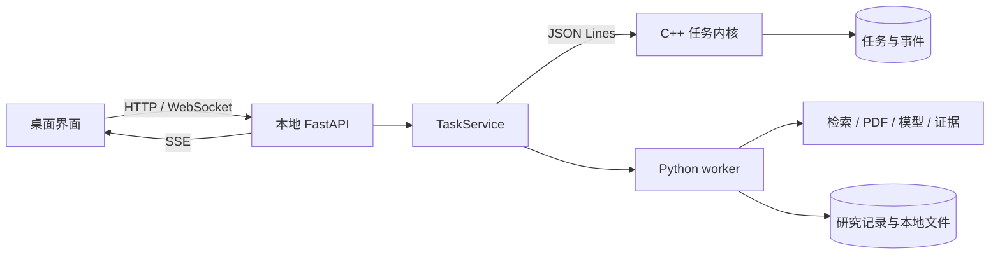

<p align="center">
  
</p>

<p align="center">
  <a href="#下载与开始使用">下载与开始使用</a> ·
  <a href="#研究流程">使用方式</a> ·
  <a href="docs/INDEX.md">文档</a> ·
  <a href="docs/ARCHITECTURE.md">架构</a> ·
  <a href="README.en.md">English</a>
</p>

<p align="center">
  
  
  
  
  
</p>

PaperPilot 是一个研究方向分析的桌面论文 Agent。输入问题或实现想法，它会检索和阅读多篇论文，根据证据选择补查、比较或交付，回答文献成绩、方法差异、已有工作和候选研究空白等问题。论文、讨论和报告保存在本地工作区。

现阶段更适合深度学习方向的研究者使用。各研究方向共用一套流程，无需安装领域插件；不同领域的结论质量尚未分别评测。

[](docs/assets/readme/home.png)

截图来自当前应用的本地页面，使用人工编写的示例资料。过程图展示保存记录的回放，不作为研究效果证明；点击图片可查看清晰原图。

## 更新内容

`v0.2.0-preview.1` 的更新草稿包括按问题选择研究行动、增量整理论文库、本地全文混合检索和报告修订，也改善了会话与 PDF 接续、对话内流式显示。见[版本说明](docs/releases/v0.2.0-preview.1.md)。草稿中的版本尚未发布，可用版本以 Releases 页面为准。

## 下载与开始使用

软件包见 [GitHub Releases](https://github.com/DirtyDidsDoneDerCheap2049/PaperPilot/releases)，也可以[从源码运行](#从源码运行)。Windows 包沿用文件名 `AIReader-windows-preview.zip`，其中的启动程序是 `AIReader.exe`；应用内名称为 PaperPilot。

1. 完整解压 `AIReader` 文件夹，双击 `AIReader.exe`。不要只复制 EXE。
2. 在「连接与设置」填写模型服务地址、API Key 和模型名称，接口需兼容 OpenAI Chat Completions。
3. 输入研究问题，使用「研究 Agent」开始分析。已有论文可以批量导入 PDF 或从论文库选中。

软件包无需另装 Python、MySQL 或后端服务器，也无需注册 PaperPilot 账号。需要 Windows WebView2 Runtime；没有模型密钥时，仍可浏览界面和导入 PDF。

全文下载受访问权限和来源限制。未获取全文时，可以手动补充 PDF，或基于已有资料继续；仅有摘要时，报告会说明证据范围。模型调用由所配置的服务账户付费，建议先用少量论文测试，并在供应商端设置额度。

## 研究流程

### 从问题选择行动

可以问“这个方向有哪些尚未覆盖的方法组合”，也可以要求比较某项指标、整理一组文献或核对指定论文。Agent 先确定资料范围和回答条件，再选择检索、核对来源、全文检索、阅读、分析或交付，允许分析后补查。

明确要求只核对指定资料时，不扩展成全领域调查。近期问题按当前日期筛选，无法确认日期的论文不计入近期确认结果。达到论文、行动或模型请求预算时，交付已核实部分并列出未完成项。见[研究调度](docs/ADAPTIVE_RESEARCH.md)。

### 论文库与全文检索

论文库支持题录搜索、批量 PDF 导入、资料选择和全文状态查看。「自动整理」生成主分类、方法标签和阅读摘要，输入时序、先验、监督方式等维度可独立筛选。再次整理沿用已有目录，只处理新增或变化的资料。

程序核对重复身份后合并显示，保留原 PDF、解析和历史引用；整理可撤销。见[论文库整理](docs/LIBRARY_ORGANIZATION.md)。

<p align="center"><a href="docs/assets/readme/library.png"></a></p>

「全文检索」在本机结合关键词与向量，查找原文章节、表格和出处。Agent 也调用该工具；选中的论文仍保留在读取范围内，不会因为未进入检索前几名就被丢弃。见[全文混合检索](docs/FULLTEXT_RETRIEVAL.md)。

### 研究报告与实时过程

研究过程直接显示在对话中，逐篇阅读发现和报告草稿随输出更新。已完成步骤可收起，思考保持单行预览，不进入报告；刷新后可回放已保存的过程。

报告先回答问题，再给依据：研究空白直接列候选差异，数值比较先给各组核实结果，综述和事实核查按所问内容组织。原文引用、比较条件及资料缺口随结论呈现。有限检索不能证明全球最优或研究新颖性，模型复核也不能替代原文核查和实验。

[](docs/assets/readme/conversation.png)

[](docs/assets/readme/report.png)

### 接续讨论与报告修订

同一会话保留最近讨论、研究计划及仍存在的上传或选中论文。「讨论结果」基于现有上下文回答，最多附带 8 篇论文摘录，不重新检索；切回「研究 Agent」后可继续核查。独立方向可新建研究。

直接要求“把报告改得简短些”或“调整报告结构”时，Agent 使用原报告和已保存的分析生成修订版，不重新检索、阅读论文；原稿保留。要求补充证据或重查事实时，仍走研究流程。写作使用随包的 Naturawrite 规则。见[模型输出与报告](docs/MODEL_OUTPUT.md)。

历史会话可搜索，直接讨论的回复默认展开，研究报告可单独阅读对应版本。未发送的草稿在当前窗口内按会话保留，关闭应用后不保留。

### 任务与资料导出

「任务记录」可查看、取消或重试任务。关闭应用会中断正在执行的任务，重开后需手动重试；重试从流程起点开始，可能再次计费。尚未开始的排队任务可继续执行。

「缺全文」按当前研究、会话或整库查看资料，提供原文入口和题名搜索途径。补充 PDF 后，需要在原会话重新分析才能更新报告。

研究资料包按会话、报告或选中论文导出 Markdown、JSON 和校验清单。PDF 不自动包含；分享前应检查研究内容是否适合公开。

## 模型配置

支持 OpenAI Chat Completions 兼容接口，可手填模型 ID，配置长度参数、JSON 模式和供应商附加参数。自动模式只向 DeepSeek 官方端点发送专用思考参数；不支持 Responses 和 Anthropic 原生协议，厂商兼容性需实际验证。

官方 DeepSeek 配置预填 `deepseek-flash` 和 `max` 思考档位。默认单次输出预算为 65,536 token，包含思考，超时为 600 秒；模型 ID 以服务商为准。连接测试核对模型列表，不生成回答。

新工作区默认处理上限为 60 篇全文、200 次模型请求和 120 分钟。已有工作区保留原设置；研究并发、输入容量和数据库配置可调整，数据库位于高级选项。见[模型用量与缓存](docs/MODEL_COST.md)。

<p align="center"><a href="docs/assets/readme/settings.png"></a></p>

## 数据与隐私

默认工作区为 `%LOCALAPPDATA%/AIReader/workspace`，在「连接与设置 → 高级选项 · 工作区与数据库」中可查看实际位置。SQLite 是默认存储，无需数据库服务；MySQL 为可选配置，不提供自动云同步。

| 操作 | 数据去向 |
| --- | --- |
| 本地 PDF 提取、全文关键词与向量检索 | 本机执行，无 embedding API 费用 |
| 模型分析、分类、讨论与报告修订 | 相关论文文本和对话发送到所配置的模型服务 |
| 可选 MinerU 解析 | 论文发送到所配置的解析服务 |
| 可选外部向量路径 | 相关文本发送到所配置的服务 |

Windows API 密钥由当前系统用户的 DPAPI 加密保存，换电脑或账号后需重新配置。备份应先关闭程序，再复制完整工作区；MySQL 还需数据库快照。见[工作区指南](docs/WORKSPACE_GUIDE.md)和[MySQL 说明](docs/MYSQL.md)。

## 架构

| 部分 | 技术与职责 |
| --- | --- |
| 桌面窗口 | pywebview、本地 HTML / CSS / JavaScript |
| 本地接口 | FastAPI、WebSocket、SSE；回环监听、请求检查、持久事件回放 |
| 任务内核 | C++17；持久任务、幂等、状态转换、执行代次、工作区互斥 |
| 分析进程 | Python worker；检索、PDF、模型、证据及报告工具 |
| 存储 | SQLite 或 MySQL；结构化记录，PDF 和报告保存在工作区文件中 |
| 全文检索 | ONNX 多语言 embedding、Chroma、SQLite FTS |
| 进程通信 | JSON Lines 管道；Python TaskService 与 C++ 内核 |


```mermaid
flowchart LR
    UI[桌面界面] -->|HTTP / WebSocket| API[本地 FastAPI]
    API --> Tasks[TaskService]
    Tasks -->|JSON Lines| Native[C++ 任务内核]
    Native --> Jobs[(任务与事件)]
    Tasks --> Worker[Python worker]
    Worker --> Tools[检索 / PDF / 模型 / 证据]
    Worker --> Data[(研究记录与本地文件)]
    API -->|SSE| UI
```

一个工作区同时只允许一个程序实例和一个研究任务；任务内部可并行处理独立论文。请求、恢复和存储边界见[架构说明](docs/ARCHITECTURE.md)。

## 从源码运行

以下命令适用于 Windows PowerShell、Python 3.12，在项目目录执行：

```powershell
python -m venv .venv
.venv/Scripts/python.exe -m pip install -r requirements-lock-windows-py312.txt
.venv/Scripts/python.exe scripts/build_native.py
.venv/Scripts/python.exe -m src.app.desktop
```

构建使用 Zig 编译 C++17，原生依赖按固定版本下载并校验 SHA-256。本地 embedding 模型由 `scripts/prepare_embedding_model.py` 准备，桌面构建自动附带。开发依赖见 `requirements-dev.txt`。

指定工作区、检查和构建：

```powershell
.venv/Scripts/python.exe -m src.app.desktop --workspace D:/ReaderData/research
.venv/Scripts/python.exe -m pytest tests -q
node --test tests/test_conversation_ui.cjs tests/test_live_ui.cjs
.venv/Scripts/python.exe scripts/build_desktop.py
.venv/Scripts/python.exe scripts/prepare_release.py --check-only
```

桌面构建输出到 `dist/public-desktop/AIReader/`。目录约定见[项目目录](docs/WORKSPACES.md)，源码导出和发布见[发布指南](docs/PUBLISHING.md)。

## 限制

- 本地 PDF 提取没有 OCR；扫描件、表格和复杂版式可能解析不完整，全文获取受访问权限限制。
- 独立下载、模型阅读及核查批次默认并发 3，可设为 1–6；本地 PDF 解析仍顺序执行。决策、综合分析和报告按依赖执行，没有并行子代理调度。
- 全文能放入输入预算时直接读取；超预算时检索相关完整章节和表格，并标明部分读取。预算采用保守估算，收到全文不保证理解正确。
- 本地索引可重建，首次建立需要时间和内存；首次检索冷加载会短暂阻塞状态接口。资源条件见[实测记录](docs/LOCAL_RETRIEVAL_BENCHMARK.md)。
- 数据库、报告文件和任务状态没有共同事务，中断后可能留下部分结果。重试前先检查已有产物。
- 暂无多用户协作、自动跨设备同步、云端持续执行和自动更新。Windows 包尚未完成干净系统安装验证和代码签名。

## 许可证

源码采用 [AGPL-3.0-only](LICENSE)，依赖及模型许可见 [THIRD_PARTY.md](THIRD_PARTY.md)。分发二进制需提供对应源码和构建说明；导入论文及其他第三方资料保留原权利归属，不纳入本项目代码许可。
