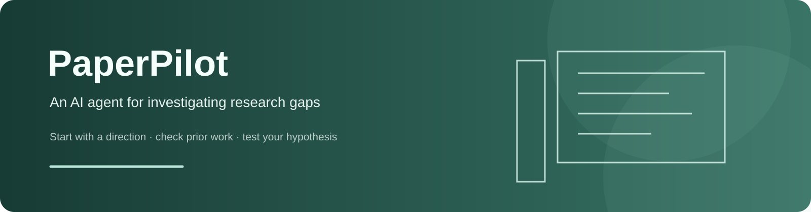
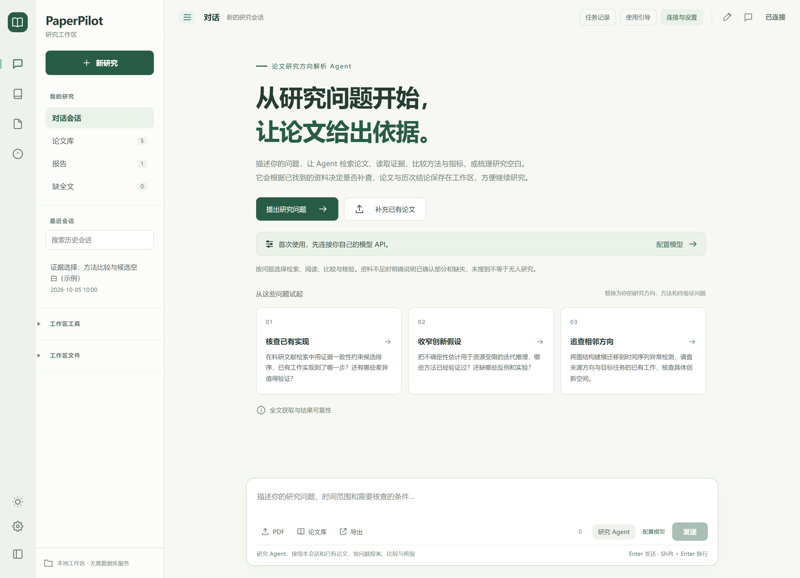
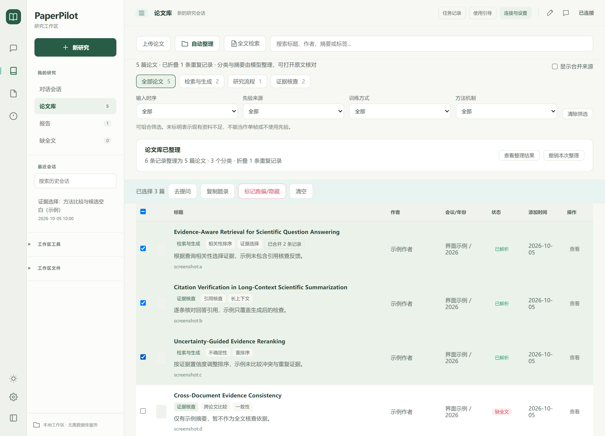
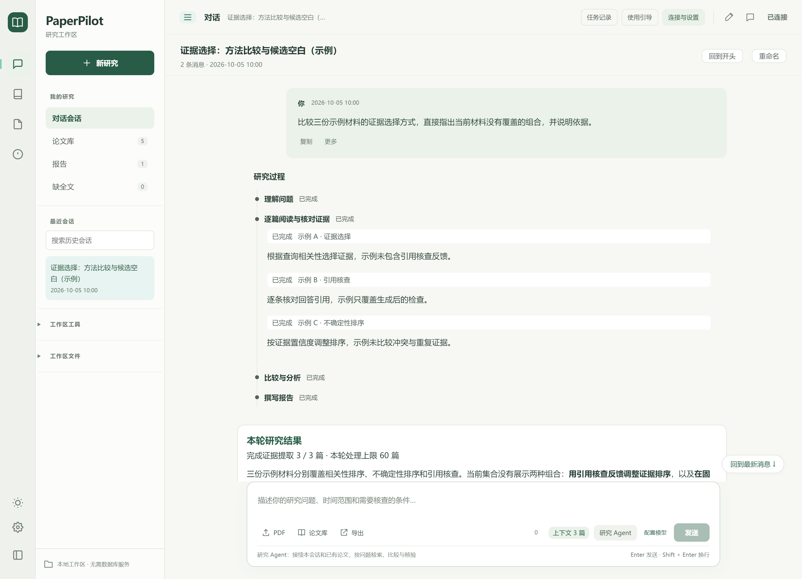
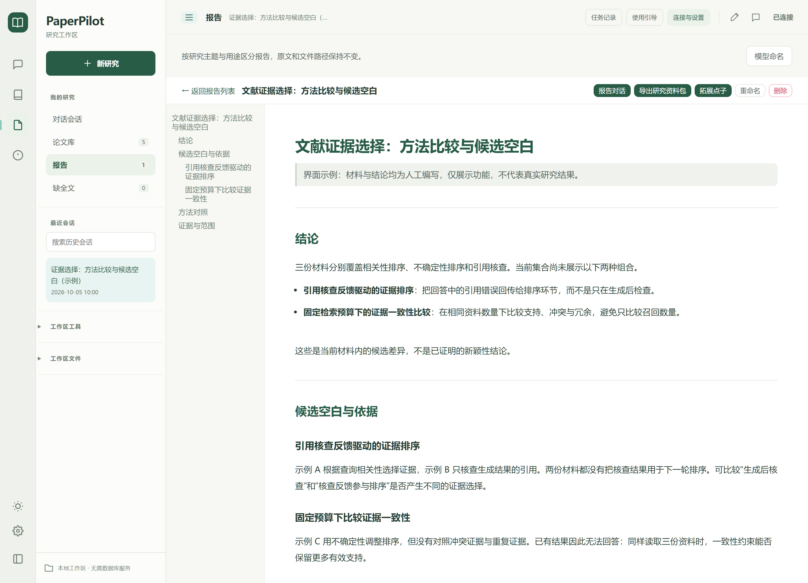
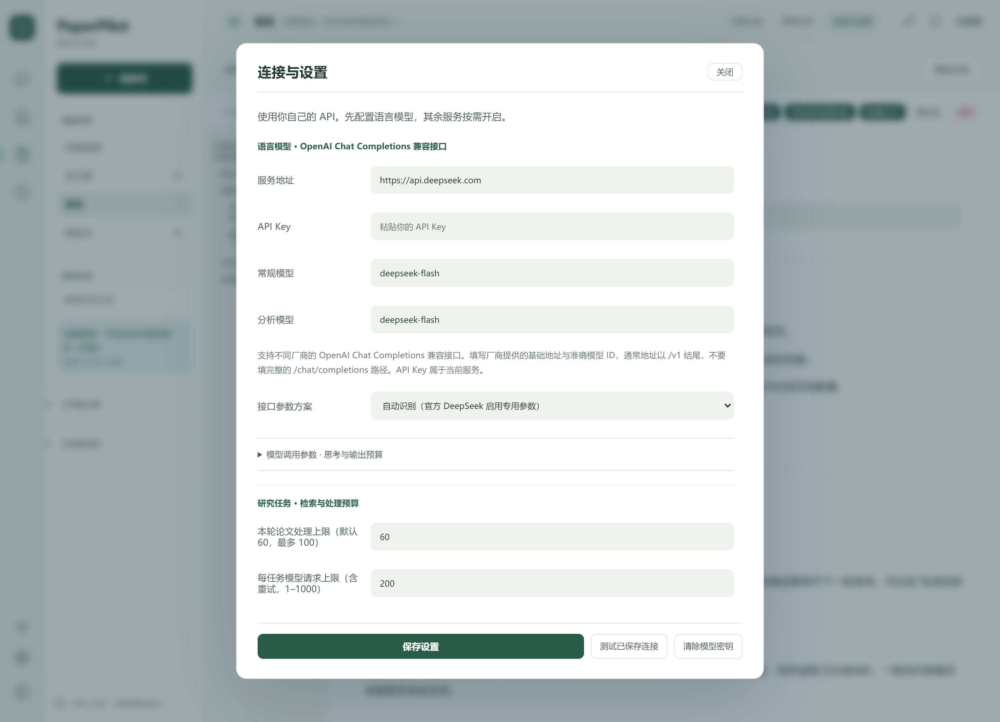
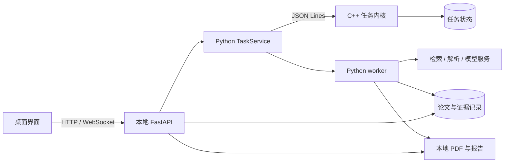

<p align="center">
  
</p>

<p align="center">
  <a href="#下载与开始使用">下载与开始使用</a> ·
  <a href="#研究流程">使用方式</a> ·
  <a href="docs/WORKSPACE_GUIDE.md">工作区与备份</a> ·
  <a href="docs/ARCHITECTURE.md">后端设计</a> ·
  <a href="README.en.md">English</a>
</p>

<p align="center">
  
  
  
  
  
</p>

PaperPilot 是一个通过论文检索与分析探索研究方向的桌面 Agent。输入研究问题或实现想法，它会检索相关论文、尝试获取全文，比较多篇论文的方法与证据，整理已有工作和值得进一步验证的差异。研究记录保存在本地工作区。

现阶段更适合深度学习方向的研究者使用。

可以从问题开始，也可以批量导入已有 PDF。工作区保存论文、证据、报告和讨论，补充资料或提出新想法后，可以在原会话继续研究。项目的发展方向见[产品目标](docs/PRODUCT_PURPOSE.md)。

不同研究方向使用同一套流程，无需安装领域插件。

[](docs/assets/readme/home.png)

截图使用人工编写的示例内容。

## 下载与开始使用

目前可[从源码运行](#从源码运行)。Windows 预览包名为 `AIReader-windows-preview.zip`，启动程序为 `AIReader.exe`，暂无公开下载链接。

1. **完整解压软件包。** 保留整个 `AIReader` 文件夹，双击其中的 `AIReader.exe`，不要只复制 EXE。
2. **连接自己的模型。** 在「连接与设置」填写服务地址、API Key 和模型名称。接口需要兼容 OpenAI Chat Completions，模型名以供应商提供的为准。
3. **开始研究。** 输入研究问题或实现想法，使用「研究 Agent」检索已有工作、核查候选研究空白。已有论文可选中或导入作为补充资料。

使用软件包无需安装 Python、MySQL 或部署服务器，也无需注册 PaperPilot 账号。需要 Windows WebView2 Runtime；没有模型密钥时，可以先浏览界面、导入 PDF。

全文下载受访问权限和来源限制。遇到缺全文提示时，可以手动补充 PDF，或基于已有资料继续；仅有摘要时，分析范围也会相应缩小。

模型调用费用由你的服务账户承担。建议先用少量论文测试，并在供应商端设置额度。

## 研究流程

### 研究问题与实现想法

例如：“在科研文献检索中用证据一致性约束候选排序，已有工作做到哪一步？还有哪些差异值得验证？”Agent 会拆解问题，检索相关实现与证据，并结合选中的论文展开分析。

生成报告前，Agent 会围绕候选差异和未核查资料补充检索、阅读。达到查询、论文或模型调用上限时，报告会列出剩余缺口，之后可在同一会话继续研究。

### 论文库与全文资料

论文库支持搜索题录、批量导入 PDF、查看全文获取状态和选择分析材料。补传缺失的 PDF 后，可以在同一会话使用「研究 Agent」更新分析。

<p align="center"><a href="docs/assets/readme/library.png"></a></p>

### 方法比较与研究报告

Agent 提取论文方法与原文证据，核查研究主张，比较已有工作和候选差异。证据索引记录主张、方法之间的关系及原文来源，报告据此说明每个候选空白与已有工作的区别；依据不足的候选标为“待核实”。未获取全文或未检索到相关论文的情况列为资料缺口。

报告按结论、候选研究空白、已有工作和本轮分析范围组织。已被覆盖或未采纳的想法会说明原因；没有足够依据提出候选时，也会如实说明。逐篇处理记录单独保存，包括证据核查完成、仅有摘要和尚未分析的论文。

对话中显示检索数量、全文处理进度和分析状态，阅读发现逐段呈现。当前步骤展开，已完成步骤可收起；模型思考保留单行预览，不进入报告。已保存的过程可在刷新后恢复。

报告帮助定位后续阅读和验证的重点，研究新颖性仍需结合原文和实验判断。

### 后续研究与讨论

「研究 Agent」用于补充检索、核查报告中的想法或研究相邻方向；「讨论结果」基于已有上下文回答，最多附带 8 篇论文片段，不重新检索或更新研究结论。同一会话承接已有方向、论文和候选上下文，独立方向可新建研究。

历史会话可以搜索，消息可以复制，长内容可以展开；历史报告可单独打开阅读对应版本。切换会话时，未发送的草稿会在当前窗口内保留，关闭应用后不保留草稿。

[](docs/assets/readme/conversation.png)

[](docs/assets/readme/report.png)

### 任务管理与资料导出

会话、论文记录和报告保存在本地工作区，重新打开应用后可以继续查看和讨论。

耗时操作可在「任务记录」中查看、取消或重试。关闭应用会中断正在执行的任务；重新打开后由你决定是否重试，重试可能再次产生 API 费用。尚未开始的排队任务会继续执行。

「缺全文」支持按本会话最近一轮或整个工作区筛选，补充 PDF 后需重新分析。资料可导出为 ZIP，包含 Markdown、结构化 JSON 和校验清单，便于分享或交给其他模型复核；PDF 需另行提供。分享前请检查其中的私人研究内容。

### 模型服务配置

在设置中填写模型地址、密钥和模型名称。DeepSeek 官方接口预填 `deepseek-flash`，实际可用的模型 ID 以服务商为准。常规与分析任务可使用同一模型，也可分别设置思考强度、输出预算和请求超时。

支持 OpenAI Chat Completions 兼容接口，可手动填写模型 ID，配置输出长度参数、JSON 输出方式和服务商附加参数。自动模式仅向 DeepSeek 官方端点发送专用思考参数；服务未提供模型列表接口时，可继续使用手动配置。Responses 和 Anthropic 原生协议暂不支持。

新工作区默认最多处理 50 篇全文、请求模型 200 次，任务时限为 120 分钟；已有工作区保留原篇数设置。连接测试核对所填模型与服务返回的模型列表，不发起生成请求。论文解析、向量检索可按需开启，数据库设置位于高级选项。

<p align="center"><a href="docs/assets/readme/settings.png"></a></p>

## 数据存储与隐私

默认工作区是 `%LOCALAPPDATA%/AIReader/workspace`。在「连接与设置 → 高级选项 · 工作区与数据库」中可以查看当前位置。默认使用内置 SQLite，不需要另外维护数据库服务。

记录保存在本地；分析时的数据去向如下：

| 操作 | 数据去向 |
|---|---|
| 默认 PDF 文本提取、文本检索 | 在本机执行 |
| 模型分析与问答 | 相关论文文本和对话内容发送到你配置的模型服务 |
| 可选 MinerU 解析 | 开启后论文发送到外部解析服务 |
| 可选外部向量检索 | 相关文本发送到配置的向量服务 |

Windows 上，API 密钥通过当前系统用户的 DPAPI 加密保存。换电脑或系统账号后需重新配置。分享日志、报告或工作区前，请检查其中的私人内容和路径。

备份时先关闭 PaperPilot，再复制完整工作区。导入旧记录、更换工作区和恢复方法见[工作区指南](docs/WORKSPACE_GUIDE.md)。MySQL 是可选模式，已有 MySQL 工作区继续使用原配置；它不提供自动云同步，备份时还需保存数据库快照，见 [MySQL 说明](docs/MYSQL.md)。

## 架构

| 部分 | 技术与职责 |
|---|---|
| 桌面窗口 | pywebview 与本地 HTML / CSS / JavaScript；会话、论文库、报告和设置 |
| 本地 API | FastAPI、WebSocket；请求校验、交互与任务进度，只监听本机回环地址 |
| 任务内核 | C++17；持久任务、幂等检查、状态转换、执行代次与互斥 |
| 分析进程 | Python worker；论文检索、PDF 解析、模型调用与证据处理 |
| 存储 | 默认 SQLite、可选 MySQL；结构化记录与任务状态，PDF 和报告保存在工作区文件中 |
| 进程通信 | JSON Lines 管道；连接 Python 任务服务与 C++ 内核 |


```mermaid
flowchart LR
    UI[桌面界面] -->|HTTP / WebSocket| API[本地 FastAPI]
    API --> Tasks[Python TaskService]
    Tasks -->|JSON Lines| Native[C++ 任务内核]
    Native --> Jobs[(任务状态)]
    Tasks --> Worker[Python worker]
    Worker --> Providers[检索 / 解析 / 模型服务]
    Worker --> Research[(论文与证据记录)]
    Worker --> Files[本地 PDF 与报告]
    API --> Research
    API --> Files
```

一个工作区同时只允许一个 PaperPilot 实例，一次执行一个研究任务。中断任务需手动重试；重试从流程起点开始，可复用已有论文画像。

请求流程、证据核查和异常处理见[架构说明](docs/ARCHITECTURE.md)。

## 从源码运行

以下命令适用于 Windows PowerShell、Python 3.12。在项目目录执行：

```powershell
python -m venv .venv
.venv/Scripts/python.exe -m pip install -r requirements-lock-windows-py312.txt
.venv/Scripts/python.exe scripts/build_native.py
.venv/Scripts/python.exe -m src.app.desktop
```

C++ 构建使用 Zig 编译 C++17，首次下载固定版本的 SQLite 和 JSON 头文件并校验 SHA-256。锁文件包含运行、可选向量与构建依赖；精简开发安装可使用 `requirements-dev.txt`，向量功能另装 `requirements-vector.txt`。

指定工作区：

```powershell
.venv/Scripts/python.exe -m src.app.desktop --workspace D:/ReaderData/research
```

运行离线检查、构建桌面包：

```powershell
.venv/Scripts/python.exe -m pytest tests -q
node --test tests/test_conversation_ui.cjs
.venv/Scripts/python.exe scripts/build_desktop.py
.venv/Scripts/python.exe scripts/prepare_release.py --check-only
```

桌面包输出到 `dist/public-desktop/AIReader/`。源码导出与发布步骤见[开源指导](docs/PUBLISHING.md)。

## 功能限制

- 各研究方向共用[主张与证据核查流程](docs/DOMAIN_PROFILES.md)，结论质量尚未在各领域分别验证。
- 本地 PDF 提取不含 OCR，扫描件和复杂版式可能需要外部解析。全文下载也受来源与访问权限限制。
- 桌面包不附带 Chroma。外部向量检索需从源码安装可选依赖；切换模型后需要重新建立相应索引。
- 全文处理范围可设为 0–100 篇；模型请求上限、输出预算和任务时限可配置。新 DeepSeek 工作区的常规处理和研究分析均默认使用 `max` 思考档位，单次输出预算为 65,536 token，思考内容也占预算；单次请求超时为 600 秒。超出篇数范围的论文列为待处理，外部解析和向量服务可能另行计费。
- 全文按顺序处理，证据核查每批最多 8 篇，暂不支持并行 Subagent 调度。
- 单篇提取最多使用前 60,000 字符，长文分段与按需回读尚未完成。补充检索受轮次和预算限制。
- 数据库与报告文件尚无共同事务。异常中断后可能留下部分结果，重试前应先检查已有报告和消息。
- 暂不支持多用户协作、跨设备自动同步、云端持续执行和自动更新。Windows 预览包尚未完成干净系统安装验证和代码签名。

## 许可证

源码使用 [AGPL-3.0-only](LICENSE)，第三方依赖见 [THIRD_PARTY.md](THIRD_PARTY.md)。公开二进制时应同时提供对应源码和构建说明。导入的论文及其他第三方资料保留原权利归属，不包含在本项目代码许可中。
