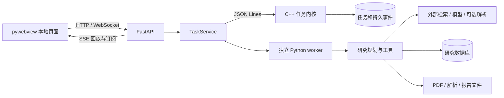

# 架构

PaperPilot 由本地桌面界面、C++ 任务内核和 Python 分析进程组成。C++ 管理持久任务和执行状态，Python 运行检索、解析、模型和证据工具；两者通过 JSON Lines 管道通信。默认存储为 SQLite，MySQL 可选。

Python 保留现有论文工具链，C++ 的边界限定在任务管理，避免把解析和模型适配重复实现为另一套服务。混合语言增加构建、进程通信和排错成本，构建脚本及协议测试用于检查这些边界。

## 请求到结果



| 入口 | 职责 |
| --- | --- |
| [desktop.py](../src/app/desktop.py) | 窗口、回环服务和后台任务的生命周期 |
| [factory.py](../src/app/factory.py) | 工作区、存储和服务装配 |
| [tasks.py](../src/runtime/tasks.py)、[main.cpp](../native/main.cpp) | Python 任务服务与原生任务协议 |
| [adaptive_research.py](../src/analysis/adaptive_research.py) | 计划、行动选择、预算和交付条件 |
| [paper_retrieval.py](../src/knowledge/paper_retrieval.py) | 本地全文混合检索 |
| [report_revision.py](../src/analysis/report_revision.py) | 已有报告的修订 |

主报告由 Orchestrator 生成。SessionRAG 和 RecoveryManager 有独立实现，当前主流程没有依靠它们完成检索或恢复；实际全文工具是 PaperRetriever，任务恢复由任务状态机处理。

## 本地接口与权限

桌面服务只监听 `127.0.0.1` 的随机端口，校验 Host、Origin 和修改请求头。文件访问限定在允许的工作区范围，上传检查 PDF 头及 50 MB 上限。

这些检查用于保护桌面内部接口，不提供多用户身份、远程租户隔离或公网部署能力。本机恶意进程和恶意 PDF 没有操作系统沙箱隔离，独立 worker 也不是权限沙箱。

## 持久任务

每行 JSON 请求对应一个响应。提交事务持久化任务；相同幂等键和内容返回已有任务，不同内容产生冲突。同会话不能同时提交两个活跃任务。

```text
queued → running → succeeded / failed
                  → cancel_requested → cancelled
启动发现旧 running / cancel_requested → interrupted
显式 retry → queued
```

领取增加执行代次 token，完成和事件写入必须匹配当前代次。Windows 文件句柄、POSIX flock 保护工作区；MySQL 使用 GET_LOCK 限制同库内核实例。C++ 以 RAII 管理连接、语句和锁，协议处理本身为单线程。

重启不会自动重跑已开始的付费任务，排队任务可继续。显式重试从流程起点开始，可以复用已有有效证据，并非任意步骤断点续跑。取消终止本地后续执行并尝试关闭请求；供应商对已收到的请求是否停止计算、如何计费不由程序控制。

执行代次保护本地状态，不能保证外部 API 恰好调用一次。外部已完成而本地未确认时，重试仍可能重复计费。

## 研究执行

同一个规划模型在 `search / lookup / retrieve / read / analyze / deliver` 中选择行动。问题计划确定任务类型、资料范围、时间窗和回答条件；程序约束重复查询、无效行动、读取覆盖和预算。见[研究调度](ADAPTIVE_RESEARCH.md)。

独立下载、模型阅读和审计批次默认并发 3，可配置为 1–6。调用 ID、论文标签、结果顺序和总预算分别维护。本地 PDF 解析仍顺序执行；决策、综合分析和报告按依赖执行，没有并行子代理。

新工作区默认最多处理 60 篇全文、200 次模型请求、120 分钟。预算随任务提交保存，协调器和 worker 使用同一快照。SDK 重试关闭，应用重试计入请求数。请求数和时限不等于统一金额上限，供应商额度仍需单独设置。

## 全文、证据与缓存

全文能放入输入预算时直接读取；超预算时使用本地混合检索选择完整章节和表格，记录部分读取及原文区间。容量按配置或端点默认值估算，并预留输出空间。UTF-8 字节数用于保守上界，不等同于供应商的实际 token 数。

本地检索采用多语言 ONNX embedding、Chroma 和 SQLite FTS，按原文及模型指纹增量索引。全文直接读取时标记待更新索引，空闲 5 秒后补建；新研究优先，超预算全文按需建索引。旧题录检索的可选外部向量路径与此独立。见[全文检索](FULLTEXT_RETRIEVAL.md)。

模型结构输出经过字段检查，引文匹配解析文本并记录路径、SHA-256 和字符范围。无法绑定原文的引用不能充当直接全文证据；相关性和语义正确性仍需核查。覆盖、候选差异和反证规则见[证据与覆盖](DOMAIN_PROFILES.md)。

证据缓存绑定原文、问题、规则、服务地址、模型和有效参数，复用前重新检查引用。失败输出不覆盖旧画像。供应商前缀缓存与本地证据复用是两套机制，见[用量与缓存](MODEL_COST.md)。

## 流式界面与报告

worker 使用流式 Chat Completions。正文约每 50 ms 合并写入持久事件，首段和结束及时刷新；事件唤醒 SSE，游标与 attempt token 支持断线回放和重试隔离。页面按帧更新增长中的正文，保留已完成节点。思考只显示最多 220 字符的单行预览，不拼进报告，不显示原始 JSON。见[性能与显示](RUNTIME_PERFORMANCE.md)。

报告按问题先给答案，再给证据和边界，使用随包 Naturawrite 规则。初稿经内容检查，允许一次修订；仍不合格时用已核实证据交付部分报告。鉴权、余额和取消错误不伪装成成功。诊断对象保存在 `.agent_history/research`，不作为报告正文。

报告修订只读取旧报告和保存分析，新增版本；直接讨论回复按消息模式展开，不因包含报告路径而折叠。研究资料包按指定范围导出，已知密钥和本地绝对路径脱敏，正文隐私仍需分享者检查。

## 存储与已知边界

- MySQL 采用 InnoDB、utf8mb4、UTC 会话和参数化语句；C++ 管任务，Python 管研究记录，文件仍在本地。
- 研究库、任务库和报告文件没有共同事务。落盘后中断可能留下报告或消息，但任务显示中断；应核对已有产物再重试。
- 解析哈希能检测变化，但每次解析的不可变全文版本尚未完整保存。历史复现依赖备份。
- 文件与数据库的报告改名、删除没有统一回滚日志。
- 有旧库初始化兼容逻辑，没有完整版本化迁移与回滚框架。旧工作区升级先在副本验证。
- 一个数据库对应一个工作区，不提供多租户共享。支持 Chat Completions 兼容协议，不支持 Responses 或 Anthropic 原生协议。

数据备份见[工作区指南](WORKSPACE_GUIDE.md)，发布验证见[发布检查](RELEASE_CHECKS.md)。
