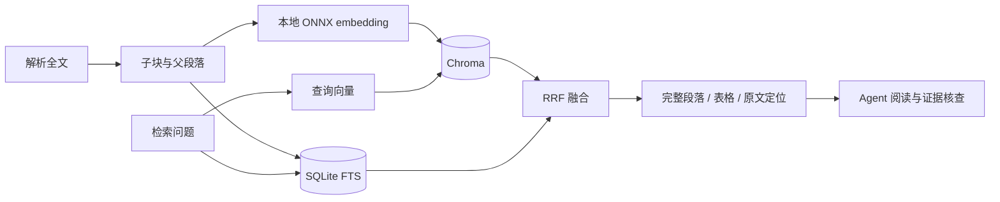

# 全文混合检索

论文库「全文检索」和 Agent 的 `retrieve` 行动使用同一个本地工具：多语言 ONNX embedding 生成向量，Chroma 保存向量索引，SQLite FTS 提供关键词检索，再通过 RRF 融合排名。

默认不需要向量服务器或 embedding API。研究模型分析仍使用所配置的 API，旧题录检索的可选外部向量路径与全文索引独立。

## 数据流



每个命中保留论文 ID、来源路径、原文 SHA-256 和字符区间。返回相关章节与表格，而不是把相似度当作引用可信度。

## 分块与模型

子块为 112 token，重叠 24，步长 88；分词偏移映射回原文。父块保留完整段落和 Markdown 表格，多个子块命中可归并到同一父块。

模型为 384 维多语言 MiniLM 的 ONNX 版本，在 CPU 上运行。模型及依赖约增加 135 MB 模型文件，首次加载和建库需要额外时间与内存。许可及固定转换版本见[第三方说明](../THIRD_PARTY.md)。

源码模型位于 `build/models/paper-embedding`，包内位于 `_internal/resources/models/paper-embedding`。派生索引保存在工作区，不与公开包一起分发。

## 增量与一致性

索引版本绑定原文哈希和模型指纹。没有变化的资料直接复用，源文件变化后拒绝旧命中。新向量写完后才激活该代，失败或未完成代不会替代有效索引。

检索沿用论文库的隐藏和重复折叠状态，可限定到当前问题的论文与时间范围。全文源文件和定位范围必须仍有效，单独复制索引不能恢复原文。

## Agent 读取

全文能放入输入预算时直接读取，不以检索前几名代替所选论文的覆盖。超预算全文按需建索引，选择相关完整章节和表格；索引不可用时，可退回关键词摘录，并记录降级。

`reading_input` 保存输入是否完整、原文范围及索引错误。局部摘录没出现某结果，不能据此断言论文没有报告；模型收到全文，也不保证准确利用每项证据。

全文直接读取时只登记待更新标记，队列空闲 5 秒后补建。新研究可让自动索引暂缓，已完成部分保留；之后按指纹增量继续。

## 操作

桌面用户在论文库打开「全文检索」，更新已有全文索引后输入问题。首次建立较大资料库时，可查看任务进度；索引缺失或原文改变时需要更新。

源码环境准备模型和更新 SQLite 工作区：

```powershell
.venv/Scripts/python.exe scripts/prepare_embedding_model.py
.venv/Scripts/python.exe scripts/index_papers.py --workspace D:/ReaderData/research
```

维护脚本只读研究库，写入派生索引；运行前关闭使用该工作区的应用。开发依赖和模型须先准备，不能与同目录的研究或索引任务竞争。

## 边界

向量检索改善跨语言和同义表达的召回，关键词检索保留模型名、指标及精确术语。RRF 不保证正确排序或答案完整性，检索命中需进一步阅读核查。

本地解析没有 OCR，扫描件和表格遗漏会影响索引。首次检索冷加载当前会短暂阻塞状态接口；不能把热查询耗时直接写成模型回答速度。

备份至少包括研究库和原文文件，索引可重建；保留索引可减少恢复后的重建时间。资源实测见[本地检索基准](LOCAL_RETRIEVAL_BENCHMARK.md)，读取预算见[模型输出](MODEL_OUTPUT.md)。
