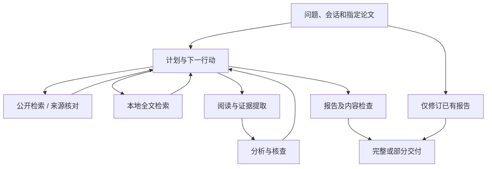

# PaperPilot v0.2.0-preview.1

状态：未发布草稿。以下变化相对首发 `v0.1.0-preview.1`，实际版本以发布标签为准。

## 功能变化

| 方面 | 变化 |
| --- | --- |
| 研究调度 | 根据问题选择空白探索、数值比较、综述或事实核查，支持分析后补查；只核对指定资料时限制研究范围。 |
| 阅读覆盖 | 默认全文上限由 50 篇变为 60 篇，可调整到 100；交付显示纳入、成功提取和未完成数量。日期按当前 Asia/Shanghai 时间判断，多个搜索来源统一过滤。 |
| 数值比较 | 绑定模型和原表行，默认按文献报告值给结论并说明评测差异；明确要求受控比较时再执行相应条件。 |
| 论文库 | 主分类、标签、阅读摘要和独立筛选维度；新增资料沿用目录、未变输入复用。确认重复后合并显示，保留文件及历史引用，可撤销。 |
| 全文检索 | 内置 ONNX 多语言 embedding，Chroma 与 SQLite FTS 混合排名；用户和 Agent 均可检索原文章节、表格及出处，默认无需 embedding API 或向量服务器。 |
| 报告 | Naturawrite 自然写作、中文显示名称和自动修订；仅改写时使用原报告及保存分析，不重读论文，原稿保留。 |
| 会话 | 讨论切回研究保留最近消息、计划和仍存在的上传 / 选中论文；原任务重试沿用首次快照，新任务读取当前历史，不恢复已删除会话。 |
| 桌面交互 | 对话内实时显示阅读发现与报告草稿，思考只保留单行预览；讨论回复展开，改善列表和表格，EXE 不再附带控制台。 |
| 全文补充与导出 | 缺全文页提供来源与搜索途径；资料包按会话、报告或选中论文导出 Markdown、JSON 和校验清单。 |

## 架构变化

首发已有 C++ 任务内核、Python 分析进程、默认 SQLite、可选 MySQL 和 Chat Completions 兼容接口，本版继续沿用。

- 一个规划模型调用工具，不新增并行子代理。程序约束资料范围、重复查询、读取覆盖及行动预算。
- 独立下载、模型阅读和审计批次默认并发 3，可设为 1–6；本地 PDF 解析仍顺序执行，综合分析和报告按依赖运行。
- 全文能放入输入预算时直接读取，超出时检索完整章节并标明部分读取。索引按原文及模型指纹更新，空闲时补建，新研究优先。
- 证据缓存保留多问题版本，验证引用后复用；稳定输入前缀改善服务端缓存机会，但不保证命中率。
- 持久事件写入后唤醒 SSE，按执行代次与游标回放；界面按帧更新增长正文，保留完成段落。
- 初稿检查后允许一次修订，仍不合格时用已核实证据交付部分报告；鉴权、余额和取消按实际失败处理。

实现与边界见[架构](../ARCHITECTURE.md)、[研究调度](../ADAPTIVE_RESEARCH.md)和[全文检索](../FULLTEXT_RETRIEVAL.md)。

## 使用与升级

完整解压 Windows 包中的 `AIReader` 文件夹，打开 `AIReader.exe`，配置兼容模型 API。需要 WebView2，不需另装 Python、MySQL 或服务器。

升级前关闭程序并备份完整工作区，再替换程序文件，保留实际数据位置。公开包不含私人研究记录或配置。切换数据库不会自动迁移资料，跨账号密钥需重新配置。见[工作区指南](../WORKSPACE_GUIDE.md)。

本地索引不产生 embedding API 费用；语言模型分析、整理与报告修订仍由服务商计费。首次建索引需要时间和内存，后续可增量复用。

## 验证范围

2026-10-05 的源码及构建验证记录为：Python 386 项通过、11 项跳过，对话和流式界面 30 项通过，构建后标准流及 GUI 子系统专项 4 项通过。专项与全量回归存在重复项，不相加。未定义名称、未使用导入、依赖、公开文档链接及产物对应检查通过；真实 MySQL 和符号链接权限项未在该轮验证。

这是该次验证的快照，不代表未来改动自动通过。在线研究质量没有由这些数字证明，旧报告也未自动重算。

92 篇真实全文的资源记录见[本地检索测量](../LOCAL_RETRIEVAL_BENCHMARK.md)。固定输入的浏览器回放见[流式性能](../RUNTIME_PERFORMANCE.md)，不能据此宣称整轮研究提速比例。

## 限制

- 有限检索和模型复核仍可能遗漏或误判，不能保证全球纪录或研究新颖性。
- 全文获取受来源权限限制，本地解析没有 OCR，向量相关性不替代原文。
- 首次冷加载检索会短暂阻塞状态接口。
- 重试不是任意步骤恢复，已发送请求仍可能计费。
- 数据库、文件和任务状态没有共同事务，升级前备份，中断后核对产物。
- 尚无干净 Windows 安装验收、代码签名、自动更新、跨设备同步和多人协作，继续以预览版提供。

源码采用 [AGPL-3.0-only](../../LICENSE)，保留[第三方许可](../../THIRD_PARTY.md)。论文资料不纳入代码许可。
